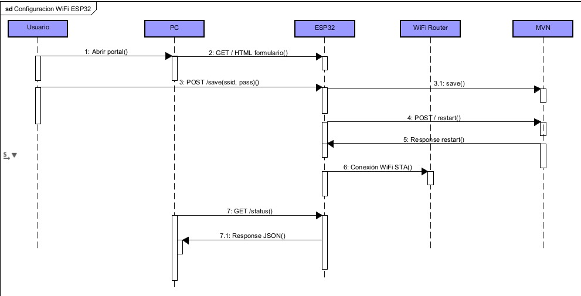
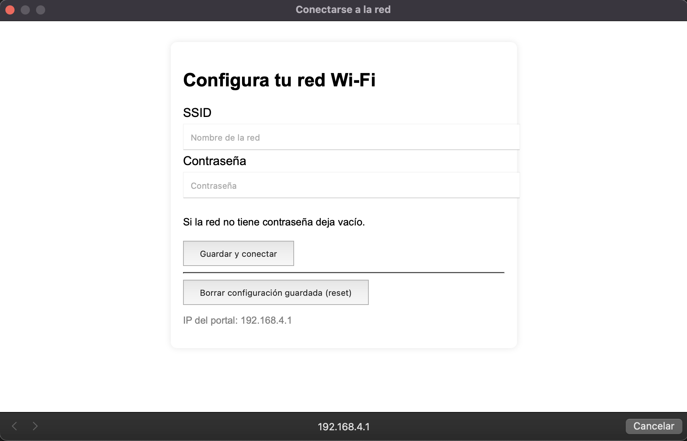
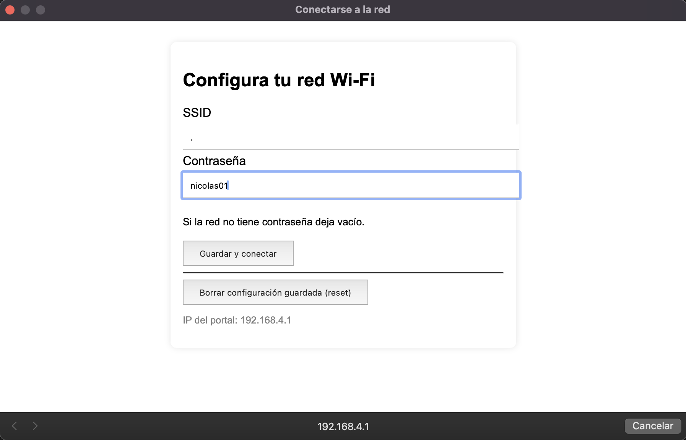
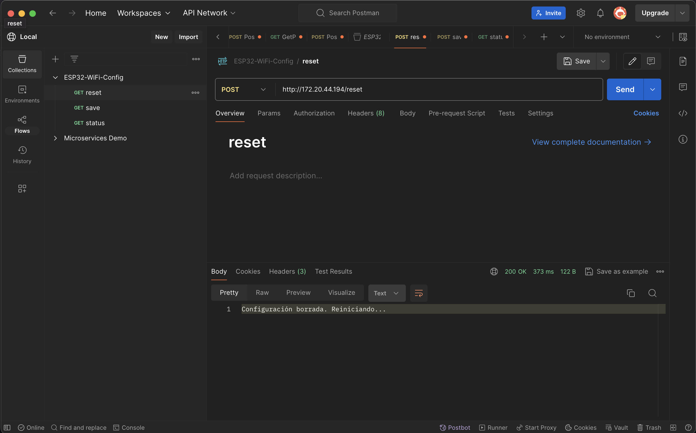
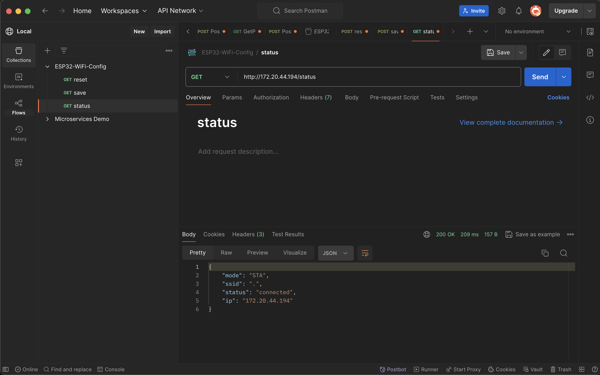

# Proyecto ESP32 – Configuración Dinámica de WiFi + API REST

Este proyecto implementa una solución IoT basada en **ESP32** que permite configurar la red WiFi de manera **dinámica** mediante un **portal cautivo / interfaz web local**, sin necesidad de reprogramar el dispositivo.  
El sistema incluye un pequeño servidor web con endpoints REST para consultar el estado, guardar credenciales y reiniciar la configuración.

---

## Características principales

- Modo **AP** (Access Point) automático cuando no existen credenciales guardadas.  
- Interfaz web local para ingresar **SSID** y **contraseña** de la red WiFi.  
- Credenciales guardadas en **memoria no volátil (Preferences / NVS)**.  
- Reconexión automática a la red configurada (modo **STA**).  
- Endpoints REST para verificar estado y reiniciar configuración.  
- Compatible con **Arduino IDE** o **PlatformIO**.  
- Documentación técnica, diagramas UML y colección Postman para pruebas.  
- Apartado de **fotografías** del prototipo funcionando y pruebas en Postman.

---

## Requisitos de Hardware y Software

- Placa **ESP32**.  
- Arduino IDE con soporte ESP32 instalado.  
- Librerías necesarias: `WiFi.h`, `WebServer.h`, `Preferences.h`, `HTTPClient.h` (opcional).  
- PC o dispositivo móvil para conectarse al AP del ESP32.  
- Postman para probar los endpoints REST.

---

## Arquitectura general

1. **Sin credenciales guardadas:**  
   - El ESP32 arranca en modo AP con SSID `ESP32_ConfigPortal`.  
   - IP por defecto `192.168.4.1`.  
   - Ofrece portal cautivo / página web para ingresar SSID y contraseña.  

2. **Con credenciales guardadas:**  
   - El ESP32 se conecta a la red WiFi configurada (modo STA).  
   - Obtiene IP del router.  
   - Servidor web responde con `/status` y `/reset`.  

---

## Endpoints REST

| Método | URL (modo AP) | URL (modo STA) | Descripción |
|--------|---------------|---------------|-------------|
| GET    | `/`           | `/status`     | Página HTML (en AP) / Estado JSON (en STA) |
| POST   | `/save`       | –             | Guarda SSID y contraseña en NVS y reinicia el ESP32 |
| GET    | `/status`     | `/status`     | Devuelve estado de conexión en JSON |
| POST   | `/reset`      | `/reset`      | Borra credenciales y vuelve a modo AP |

### Ejemplo `POST /save` (modo AP)

- URL: `http://192.168.4.1/save`
- Body (x-www-form-urlencoded):

## Flujo típico de uso
- Cargar el firmware en la ESP32 (código adjunto en el repositorio).
- La primera vez, el ESP32 creará su AP ESP32_ConfigPortal.
- Conéctate desde tu PC/móvil al WiFi ESP32_ConfigPortal.
- Abrir en navegador o Postman http://192.168.4.1/.
- Enviar POST /save con SSID y contraseña de tu WiFi.
- ESP32 se reinicia y se conecta a tu red.
- Consultar IP asignada en el Monitor Serie.
- Probar GET /status usando la nueva IP.
- Para cambiar de red nuevamente, hacer POST /reset para volver a AP.
- Nota: El código fuente Arduino está adjunto en el repositorio (main.ino).
  
## Documentación Técnica
  
*Diagrama de secuencia UML mostrando el flujo completo: usuario abre portal, ingresa credenciales, ESP32 guarda y se conecta a la red.*

## Fotografías del Funcionamiento
  
*Interfaz HTML que se muestra al abrir el portal cautivo. El usuario ve el formulario para ingresar SSID y contraseña de la red WiFi.*

  
*Pantalla que aparece después de enviar las credenciales, indicando que el ESP32 está intentando conectarse a la red configurada.*

  
*Pantalla de confirmación al presionar el botón de reset, donde se borran las credenciales guardadas y el ESP32 vuelve a modo AP.*

  
*Estado actual del ESP32 en modo STA: muestra la IP asignada, el SSID conectado y la señal (RSSI).*
